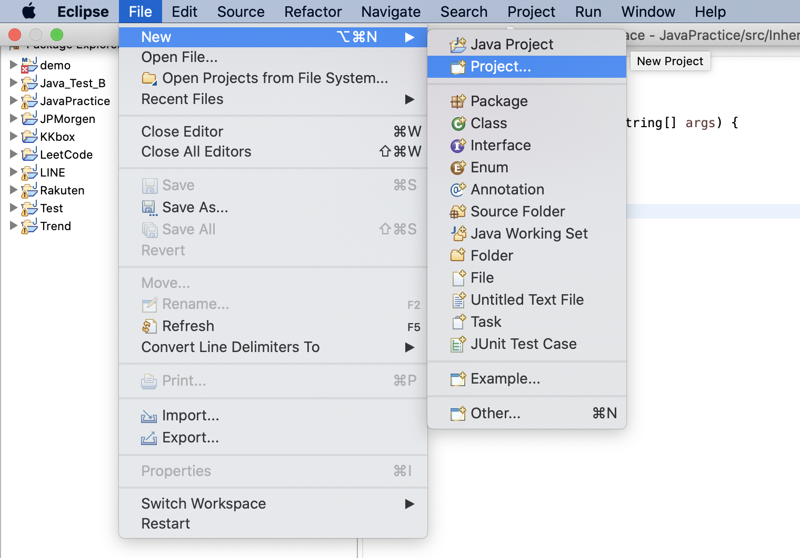
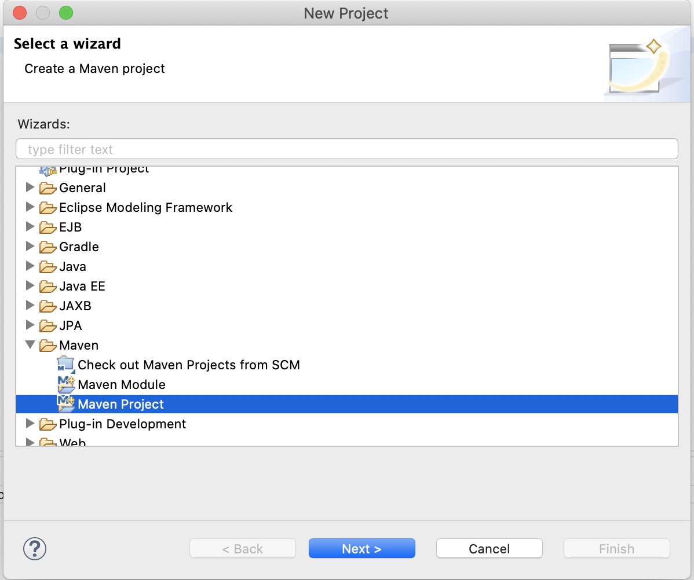
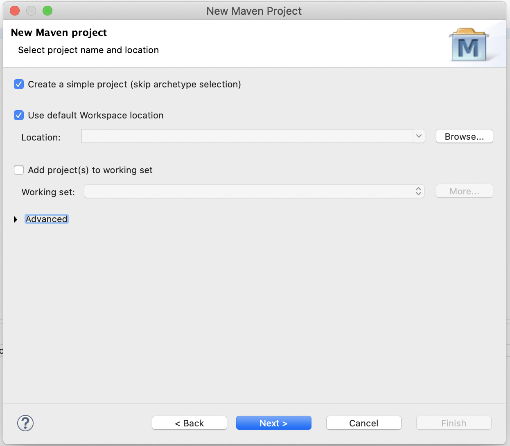
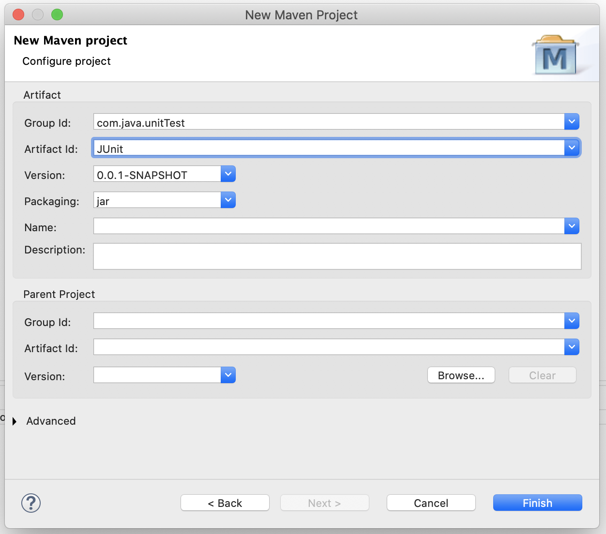
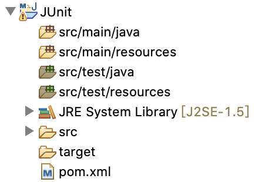
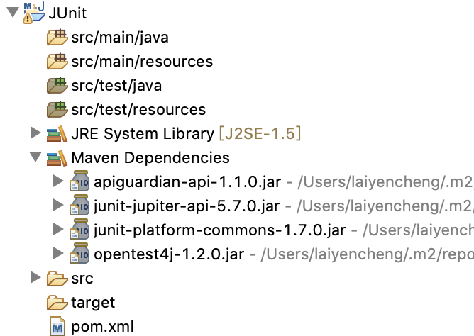

# JUnit 簡介與環境設定

### 簡介

**什麼是 JUnit ?**

JUnit 是 Java 運行單元測試的工具之一，但也是最普及、最常見的選擇，各大框架在測試工具的選擇上也是預設 JUnit，以 Java developer 來說，JUnit 是剛接觸單元測試最好的起手選擇。

此外，JUnit 和主流 Java 開發的 IDE 相容性極佳，包含 `IntelliJ`、`Eclipse` 和 `NetBeans` 都可以輕易地使用 JUnit 進行測試與查看結果，也是他受歡迎的原因之一。

值得一提的是，JUnit 目前最新的版本為 JUnit 5，IDE 方面也要是比較新的版本才會支援，否則只能使用至 JUnit 4 的版本，以`Eclipse`來說，`Eclipse Oxygen`之後的版本才支援 JUnit 5。

### 環境準備

要使用 JUnit，我們首先要引入需要的 dependencies，也就是常說的引入 jar 檔，Java 主流用來管理相依套件的工具有`maven`和`gradle`。以下我們會以`maven`搭配`Eclipse 2020-12`為主進行設定和說明。

#### 建立 maven 專案

在`Eclipse`的操作介面選 File -&gt; New -&gt; Project



跳出選單後選擇 Maven -&gt; Maven Project



選擇你要的專案配置 \( 實體儲存路徑等等 \)



輸入Group Id、Artifact Id \( Group Id 通常是 domain，而 Artifact Id 通常是專案名稱 \)



maven 專案建立完成



#### 設定 pom.xml

建立完`maven`專案後，我們的下一步就是要透過`maven`的機制引入 JUnit 需要的 jar 檔，為此我們要更改`pom.xml`檔案，`maven`會解析`pom.xml`中定義的 dependency，去對應的遠端 repository 抓取需要的 jar 檔。

這是一開始的`pom.xml`：

```markup
<project xmlns="http://maven.apache.org/POM/4.0.0" xmlns:xsi="http://www.w3.org/2001/XMLSchema-instance" xsi:schemaLocation="http://maven.apache.org/POM/4.0.0 https://maven.apache.org/xsd/maven-4.0.0.xsd">
  <modelVersion>4.0.0</modelVersion>
  <groupId>com.java.unitTest</groupId>
  <artifactId>JUnit</artifactId>
  <version>0.0.1-SNAPSHOT</version>
</project>
```

要引入 JUnit 5，我們需要知道他在 maven repository 上的 dependency 設定，所以我們可以到maven repository的網站 \( [https://mvnrepository.com/](https://mvnrepository.com/) \) 上查詢 JUnit，選擇 junit-jupiter-api 也就是 JUnit 5，再選擇想要的版本，這裡以 5.7.0 版本作為範例。

我們按照官網上提供的`maven`設定修改我們的`pom.xml`

```markup
<project xmlns="http://maven.apache.org/POM/4.0.0"
	xmlns:xsi="http://www.w3.org/2001/XMLSchema-instance"
	xsi:schemaLocation="http://maven.apache.org/POM/4.0.0 https://maven.apache.org/xsd/maven-4.0.0.xsd">
	<modelVersion>4.0.0</modelVersion>
	<groupId>com.java.unitTest</groupId>
	<artifactId>JUnit</artifactId>
	<version>0.0.1-SNAPSHOT</version>

	<dependencies>
		<!-- https://mvnrepository.com/artifact/org.junit.jupiter/junit-jupiter-api -->
		<dependency>
			<groupId>org.junit.jupiter</groupId>
			<artifactId>junit-jupiter-api</artifactId>
			<version>5.7.0</version>
			<scope>test</scope>
		</dependency>
	</dependencies>
</project>
```

簡單說明`pom.xml`中的一些 tag 的意義：

* dependencies：maven 中每一個 dependency 代表一個 jar 檔，所有的 dependency 都統一管理在 dependencies 之下
* scope：maven 一共有六種 scope，分別是：

  * compile
  * provided
  * runtime
  * test
  * system
  * import

  這些不同的scope分別代表不同的作用域和依賴傳遞限制，此處不特別說明細部差異。使用 test 代表我們這個 jar 檔只會參與測試階段，實際打包專案資源時並不會被納入其中

### 結構說明

當我們設定完`pom.xml`以後，專案的結構大致如下：



從結構上可以看到，專案底下都會有 src/main 和 src/test 兩大類，每一類底下又各自有 java 和 resources 兩種路徑，這裡的分類上 main 裡面放置的程式，代表實際要運行的核心邏輯，也就是單元測試的受測方；test 裡放置的程式，就是我們撰寫的單元測試，這部份的程式是**不會被打包進正式專案**的，僅僅執行測試時運行而已。

到此我們已經透過 maven 完成一包專案的建置，下一篇會集中在實際撰寫單元測試的內容。

