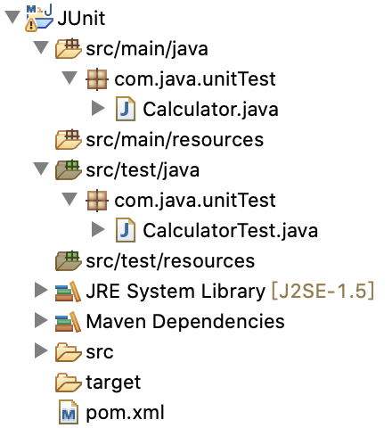
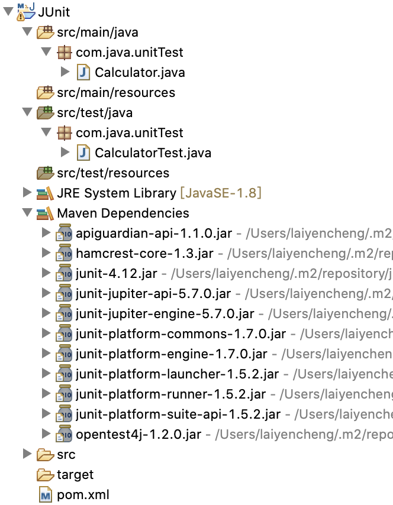
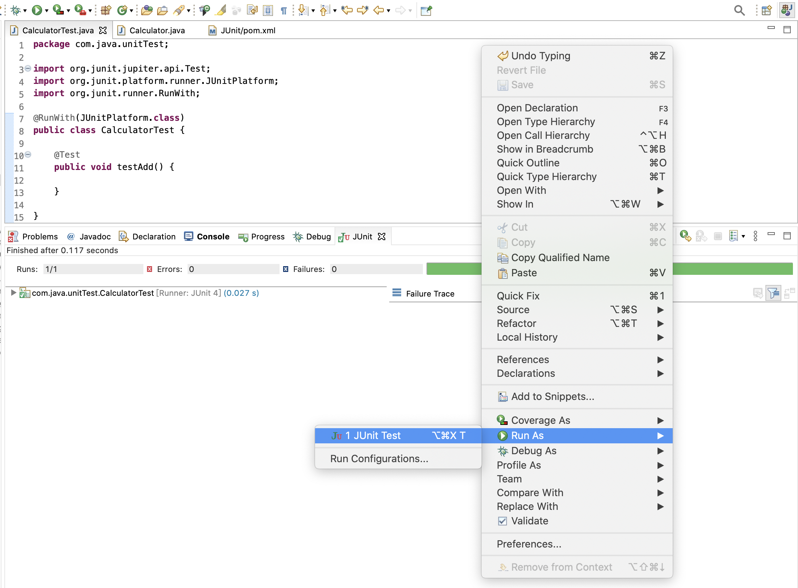
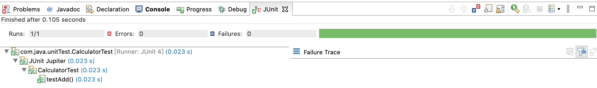
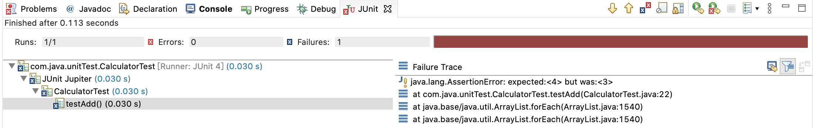

# JUnit 撰寫測試

## **撰寫前準備**

### 路徑架構

我們在上一篇 JUnit 簡介與環境設定中提到，src/main 和 src/test 兩個路徑的分類，不管是 main 還是 test，我們都會在 java folder 中撰寫程式碼，在 resource 中置放我們要引用的 jar，測試程式和主程式兩者是區隔開來的，但我們不需要去處理 resource 的部分，畢竟交給 maven處理就可以了。

沿用上一篇的專案，我們在 src/main/java 和 src/test/java 底下都建立相同的 package，並且分別建立 Calculator 和 CalculatorTest 兩支 class，前者是專案中真正運行的程式，後者則是我們要撰寫的單元測試。




### 程式碼

**Calculator**：

```java
package com.java.unitTest;

public class Calculator {

	public int add(int a, int b) {
		return a + b;
	}

}
```

**CalculatorTest**：

```java
package com.java.unitTest;

public class CalculatorTest {

	public void testAdd() {}
	
}
```

假設我們的目的是要測試 Calculartor 中的 add 方法，那我們就會在 CalculatorTest 之中撰寫 testAdd 方法，這是我們在撰寫單元測試上的命名慣例。

> 在 JUnit 4 版本前，由於是採用名稱對應的方式映射測試方法，所以每一個方法的名稱都要以 test 開頭，但 JUnit 4 版本後我們可以另外去註冊測試方式，這部分之後的篇幅會再提及。

設定到這一步，有基礎 Java 概念的各位都知道，不論是 Calculator 或 CalculatorTest 兩個類別都無法執行，Calculator 是專案中的實際程式，有可能只是作為模組本來就不該獨立執行，但測試類別必須能夠執行。

> 一個 Java 程式要能夠獨立執行，一定需要一個程式入口，也就是我們熟知的 main 方法

### 

### 在 Eclipse 中執行 JUnit

為了要在 Eclipse 中執行 JUnit 5，我們需要先引入一些環境需要的 jar 檔，所以又要再一次調整我們的`pom.xml`：

```markup
<project xmlns="http://maven.apache.org/POM/4.0.0"
	xmlns:xsi="http://www.w3.org/2001/XMLSchema-instance"
	xsi:schemaLocation="http://maven.apache.org/POM/4.0.0 https://maven.apache.org/xsd/maven-4.0.0.xsd">
	<modelVersion>4.0.0</modelVersion>
	<groupId>com.java.unitTest</groupId>
	<artifactId>JUnit</artifactId>
	<version>0.0.1-SNAPSHOT</version>

	<properties>
		<project.build.sourceEncoding>UTF-8</project.build.sourceEncoding>
		<maven.compiler.source>1.8</maven.compiler.source>
		<maven.compiler.target>${maven.compiler.source}</maven.compiler.target>
		<junit.jupiter.version>5.7.0</junit.jupiter.version>
		<junit.platform.version>1.7.0</junit.platform.version>
	</properties>

	<dependencies>
		<dependency>
			<groupId>org.junit.jupiter</groupId>
			<artifactId>junit-jupiter-engine</artifactId>
			<version>${junit.jupiter.version}</version>
			<scope>test</scope>
		</dependency>
		<dependency>
			<groupId>org.junit.platform</groupId>
			<artifactId>junit-platform-runner</artifactId>
			<version>${junit.platform.version}</version>
			<scope>test</scope>
		</dependency>
	</dependencies>

	<build>
		<plugins>
			<plugin>
				<artifactId>maven-compiler-plugin</artifactId>
				<version>3.8.1</version>
			</plugin>
			<plugin>
				<artifactId>maven-surefire-plugin</artifactId>
				<version>2.22.2</version>
			</plugin>
		</plugins>
	</build>
</project>
```

以下是我們做的改動：

* 加入 junit-platform-runner、junit-jupiter-engine
* 配置編譯插件 maven-compiler-plugin、maven-surefire-plugin

要進行這些改動的原因，主要是因為 JUnit 5 的關係，JUnit 5 可以分為三部分：

* JUnit Platform
  * 包含 JUnit 要執行所需要的執行環境、測試框架
  * 要 maven、gradle 和 cmd 必須要有此套件
* JUnit Jupiter
  * JUnit 的核心邏輯語法
* JUnit Vintage
  * 向下兼容 JUnit 5 以前版本 \( 非必要 \)

以上這些套件都引入後，重新執行 maven 組態，就可以引入 JUnit 5 要執行的必要 jar 檔，順帶一提，因為我們的 dependency 都是設定為 test scope，所以這些 resources 都只會在測試時使用，並不會被打包進正式專案，下方圖片中 jar 檔同src/test folder 一樣成深灰色就是此緣故。




## **撰寫 JUnit**

### 基本 JUnit 程式配置

我們繼續以 CalculatorTest 為藍本執行 JUnit，首先要透過 Annotation 的方式進行兩個配置：

1. 在 class 上加上 @RunWith\(JUnitPlatform.class\)
2. 在要測試的方法上加上 @Test

```java
package com.java.unitTest;

import org.junit.jupiter.api.Test;
import org.junit.platform.runner.JUnitPlatform;
import org.junit.runner.RunWith;

@RunWith(JUnitPlatform.class)
public class CalculatorTest {

	@Test
	public void testAdd() {

	}

}
```

修改完後，對該程式按右鍵 -&gt; Run As -&gt; JUnit Test，就可以在 Eclipse 中執行並看到結果。



### 功能測試

能夠正常進行 JUnit 測試後，我們下一步要進行的就是調用 Calculator 的 add 方法，並真正進行測試：

```java
package com.java.unitTest;

import org.junit.jupiter.api.Assertions;
import org.junit.jupiter.api.Test;
import org.junit.platform.runner.JUnitPlatform;
import org.junit.runner.RunWith;

@RunWith(JUnitPlatform.class)
public class CalculatorTest {

	@Test
	public void testAdd() {
	
		// arrange
		Calculator calc = new Calculator();
		int a = 1;
		int b = 2;

		// act
		int result = calc.add(a, b);

		// assert
		Assertions.assertEquals(3, result);
	}
}
```

在撰寫上一樣遵守 3A 原則：

1. 建立物件、測試方法所需要的參數
2. 執行測試方法
3. 比對結果是否如預期

撰寫完測試程式，我們可以用上面提過的方法執行 JUnit，並在 IDE 中看到執行的結果，假設一切正常，結果畫面會如下：



如果是失敗的話，畫面則會如下 \( 我們把 assertEquals 預期的輸出改成 4 \) ：



上圖可以很明顯地看到，IDE 中會提供錯誤的執行軌跡，此處的錯誤是預期輸出和實際輸出不同。

### 進階寫法

上面的範例是一個最簡單標準的單元測試的寫法，接下來我們會使用一些 JUnit 的語法特色，撰寫一些比較複雜，或者比較有特色的寫法：

Assertions：JUnit 5 對於驗證的 API，等同於 JUnit 4 的 Assert。

完整API：[https://junit.org/junit5/docs/5.0.1/api/org/junit/jupiter/api/Assertions.html](https://junit.org/junit5/docs/5.0.1/api/org/junit/jupiter/api/Assertions.html)

以下撰寫一個反面案例：

```java
	@Test
	public void testExpectedExceptionThrow() {
		Assertions.assertThrows(NumberFormatException.class, () -> {
			Integer.parseInt("Hi");
			Assertions.fail("轉型失敗未觸發");
		});
	}
```

包含上面的範例程式碼，我們一共用了以下幾個 API：

* assertEquals：傳入兩個參數比對是否相同，若相同則測試通過
  * 前者為預期結果，後者為執行結果
* assertThrows：傳入兩參數比對是否有觸發指定例外
  * 前者為會拋出的例外類別，後者為一匿名方法，方法應拋出該例外，否則測試不通過
* fail：傳入例外或錯誤訊息，並直接使測試強制失敗


### 注意事項

* test class 的命名最好對應要測試的 class，e.g. Calculator =&gt; CalculatorTest
* test class 應為 public class，並且方法上不要用 abstract 或 final
* Assertion 中只要是 true 的結果都會繼續往下執行，但遇到 fail 則中斷程式


