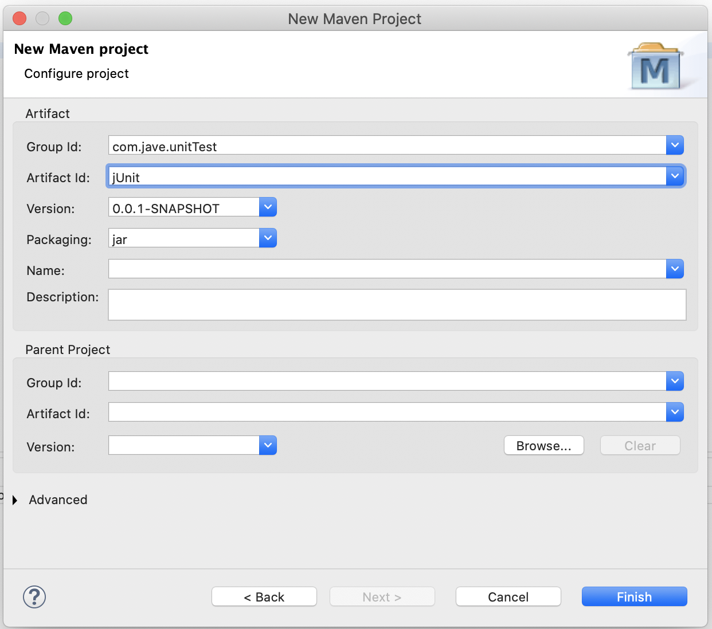

# JUnit 簡介與操作

### 簡介

**什麼是 JUnit ?**

JUnit 是 Java 運行單元測試的工具之一，但也是最普及、最常見的選擇，各大框架在測試工具的選擇上也是預設 JUnit，以 Java developer 來說，JUnit 是剛接觸單元測試最好的起手選擇。

此外，JUnit 和主流 Java 開發的 IDE 相容性極佳，包含 `IntelliJ`、`Eclipse` 和 `NetBeans` 都可以輕易地使用 JUnit 進行測試與查看結果，也是他受歡迎的原因之一。

值得一提的是，JUnit 目前最新的版本為 JUnit 5，IDE 方面也要是比較新的版本才會支援，否則只能使用至 JUnit 4 的版本，以`Eclipse`來說，`Eclipse Oxygen`之後的版本才支援 JUnit 5。

### 環境準備

要使用 JUnit，我們首先要引入需要的 dependencies，也就是常說的引入 jar 檔，Java 主流用來管理相依套件的工具有`maven`和`gradle`。以下我們會以`maven`搭配`Eclipse 2020-12`為主進行設定和說明。

#### 建立 maven 專案

在`Eclipse`的操作介面選 File -&gt; New -&gt; Project

跳出選單後選擇 Maven -&gt; Maven Project

選擇你要的專案配置 \( 實體儲存路徑等等 \)

輸入Group Id、Artifact Id \( Group Id 通常是 domain，而 Artifact Id 通常是專案名稱 \)

#### 設定 pom.xml

### JUnit 應注意：

1. Unit test class 命名應對照待側 class，e.g.  login =&gt; loginTest
2. test class 應是 public class，不要是abstract或final \(不要做任何奇怪的舉動\)
3. package src/test/java =&gt; test  ,   production =&gt; src/test/main

