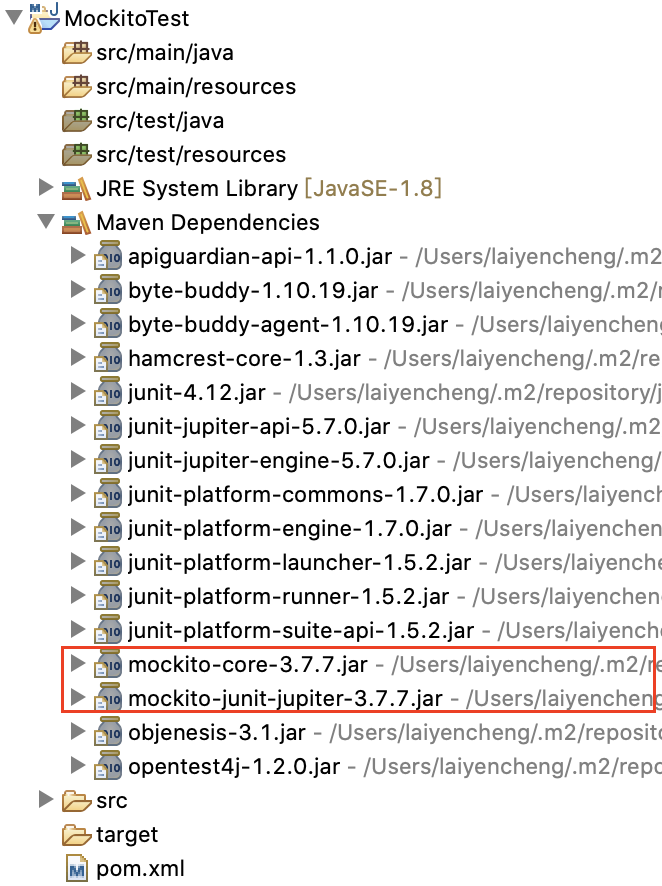

# Mockito 簡介與環境設定


## 簡介

### **什麼是 Mockito ?**

Mockito 是現階段 Java 語言在單元測試上用以做 mock 測試最盛行的工具，主要可搭配 JUnit 對 Java code 進行測試，尤其是 Spring test 主要也是使用 Mockito 對於複雜的 Bean、Service、Component 等進行生命週期的管理。

### **Mock test**

我們執行單元測試，目的就是為了確認受測模組的功能是否正常，輸出結果是否同我們所預期，以及在日後對功能的修正、更改或擴充時，是否有向下相容而不影響既有功能。

mock test 的核心就是 mock object，說白了就是創造一個假的物件，而這個物件我們可以自行去設定他的內容、狀態，這麼做有幾個好處：

* **降低複雜的依賴關係**

  假設測試的是一個登入模組，模組的核心功能是 **驗證** 和 **授權**，根據`UserObject`中的內容值進行判斷，如果我們真的訪問資料庫查詢`UserObject`的內容，那不僅執行耗效能，一旦資料遭到異動測試的結果也會受影響。

* **模擬難以重現的狀態**

  假設廣告模組設定第 100 位訪問者會得到 5 折折價券，為了測第 100 次的功能而連續執行無效的 99 次測試很明顯是不切實際的，以模擬物件狀態進行單元測試才是合理的做法。

簡言之，mock test 的好處就是大量減低依賴性，以便集中針對重要模組進行測試。

### Mock Objects 種類

* Dummy
  * 不包含實作的物件，目的是在測試中傳入但並不會被用到，使之成功編譯
* Stub
  * 當 SUT \(System Under Test\) 有依賴 DOC \(Demand-On Component\) 時，用以代替真實物件，並且指定測試過程的回傳值
* Mock
  * 驗證方法預期被調用的情況，如方法的調用次數及返回值
* Spy
  * 紀錄自身的狀態，例如被呼叫的資訊，像是如何被呼叫，被呼叫的次數等
* Fake
  * 真實物件的簡化版，測試時與被測試物件互動

## 環境配置

要使用 Mockito 第一步仍然是需要確保專案的 Java Build Path 中有必要的 dependencies，也就是專案要引入 Mockito 需要的 jar。這一次我們一樣建立一個新的 `maven` 專案，`pom.xml` 也按照之前的配置，再以此作為調整：

### **Maven Setting**

在 `pom.xml` 中加入下列 dependency：

```markup
<dependency>
		<groupId>org.mockito</groupId>
		<artifactId>mockito-core</artifactId>
		<version>3.7.7</version>
		<scope>test</scope>
</dependency>
<dependency>
    <groupId>org.mockito</groupId>
    <artifactId>mockito-junit-jupiter</artifactId>
    <version>3.7.7</version>
    <scope>test</scope>
</dependency>
```

完成後的 `pom.xml`：

```markup
<project xmlns="http://maven.apache.org/POM/4.0.0"
	xmlns:xsi="http://www.w3.org/2001/XMLSchema-instance"
	xsi:schemaLocation="http://maven.apache.org/POM/4.0.0 https://maven.apache.org/xsd/maven-4.0.0.xsd">
	<modelVersion>4.0.0</modelVersion>
	<groupId>com.java.unitTest</groupId>
	<artifactId>MockitoTest</artifactId>
	<version>0.0.1-SNAPSHOT</version>

	<properties>
		<project.build.sourceEncoding>UTF-8</project.build.sourceEncoding>
		<maven.compiler.source>1.8</maven.compiler.source>
		<maven.compiler.target>${maven.compiler.source}</maven.compiler.target>
		<junit.jupiter.version>5.7.0</junit.jupiter.version>
		<junit.platform.version>1.5.2</junit.platform.version>
	</properties>

	<dependencies>
		<dependency>
			<groupId>org.junit.jupiter</groupId>
			<artifactId>junit-jupiter-engine</artifactId>
			<version>${junit.jupiter.version}</version>
			<scope>test</scope>
		</dependency>
		<dependency>
			<groupId>org.junit.platform</groupId>
			<artifactId>junit-platform-runner</artifactId>
			<version>${junit.platform.version}</version>
			<scope>test</scope>
		</dependency>
		<dependency>
			<groupId>org.mockito</groupId>
			<artifactId>mockito-core</artifactId>
			<version>3.7.7</version>
			<scope>test</scope>
		</dependency>
		<dependency>
			<groupId>org.mockito</groupId>
			<artifactId>mockito-junit-jupiter</artifactId>
			<version>3.7.7</version>
			<scope>test</scope>
		</dependency>
	</dependencies>

	<build>
		<plugins>
			<plugin>
				<artifactId>maven-compiler-plugin</artifactId>
				<version>3.8.1</version>
			</plugin>
			<plugin>
				<artifactId>maven-surefire-plugin</artifactId>
				<version>2.22.2</version>
			</plugin>
		</plugins>
	</build>
</project>
```

如此一來，我們就完成載入 Mockito 必要的 jar 檔了。



### 測試前準備

在撰寫 Mockito test 之前，我們先準備幾隻程式，模擬一個一般系統的登入模組，當然我們並不會真的建一個資料庫去建立連線，以下是架構：

```text
src/main/java
  |-- com.java.unitTest.controller
      |-- LoginController.java
  |-- com.java.unitTest.dto
      |-- User.java
  |-- com.java.unitTest.repository
      |-- UserRepository.java
  |-- com.java.unitTest.service
      |-- AuthenticationService.java
```

LoginController 視驗證結果回傳下一流程，AuthenticationService 負責驗證邏輯，User 為 DTO 負責封裝處理資料，而 UserRepository 則是模擬和持久層的互動物件，以下是程式碼：

LoginController.java

```java
package com.java.unitTest.controller;

import com.java.unitTest.service.AuthenticationService;

public class LoginController {

	private AuthenticationService authenticationSvc;

	public String service(String username, String password) {
		return authenticationSvc.authenticate(username, password) ? "/home" : "/login";
	}

}
```

AuthenticationService.java

```java
package com.java.unitTest.service;

import com.java.unitTest.dto.User;
import com.java.unitTest.repository.UserRepository;

public class AuthenticationService {

	private UserRepository userRepo;

	public boolean authenticate(String username, String password) {
		if (username == null || password == null)
			return false;
		User user = userRepo.findByUserName(username);
		if (user == null)
			return false;
		return password.equals(user.getPassword());
	}
}
```

UserRepository.java 

```java
package com.java.unitTest.repository;

import java.util.HashMap;
import java.util.Map;

import com.java.unitTest.dto.User;

public class UserRepository {

	private Map<String, User> users = new HashMap<>();

	public UserRepository() {
		users.put("john", new User("John", "john123"));
		users.put("jack", new User("Jack", "jack123"));
		users.put("peter", new User("Peter", "peter123"));
	}

	public User findByUserName(String username) {
		return users.get(username);
	}
}
```

User.java

```java
package com.java.unitTest.dto;

public class User {

	private String username;
	private String password;

	public User(String username, String password) {
		this.username = username;
		this.password = password;
	}

	public String getUsername() {
		return username;
	}

	public void setUsername(String username) {
		this.username = username;
	}

	public String getPassword() {
		return password;
	}

	public void setPassword(String password) {
		this.password = password;
	}

	@Override
	public int hashCode() {
		final int prime = 31;
		int result = 1;
		result = prime * result + ((password == null) ? 0 : password.hashCode());
		result = prime * result + ((username == null) ? 0 : username.hashCode());
		return result;
	}

	@Override
	public boolean equals(Object obj) {
		if (this == obj)
			return true;
		if (obj == null)
			return false;
		if (getClass() != obj.getClass())
			return false;
		User other = (User) obj;
		if (password == null) {
			if (other.password != null)
				return false;
		} else if (!password.equals(other.password))
			return false;
		if (username == null) {
			if (other.username != null)
				return false;
		} else if (!username.equals(other.username))
			return false;
		return true;
	}

}
```

由於我們不打算實際和資料庫建立連線，所以 UserRepository 裡直接以簡單的方法新增幾筆假資料，實際上真正撰寫專案時則不可能這麼撰寫，請讀者自行留意。

