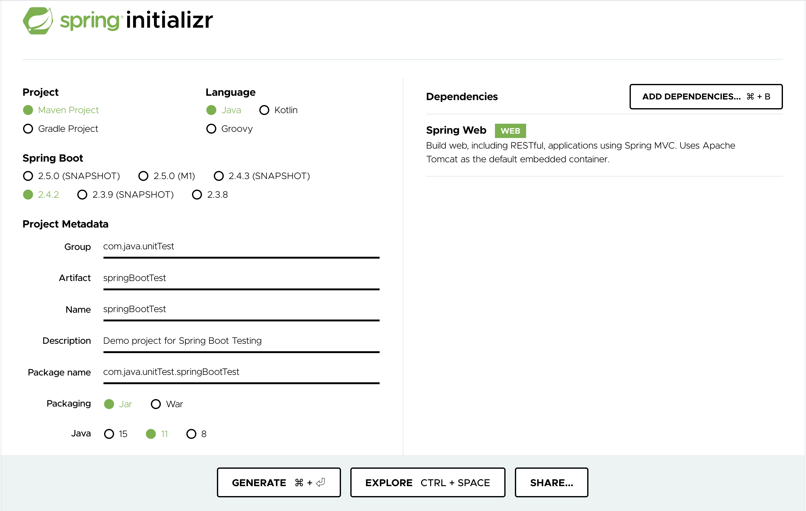
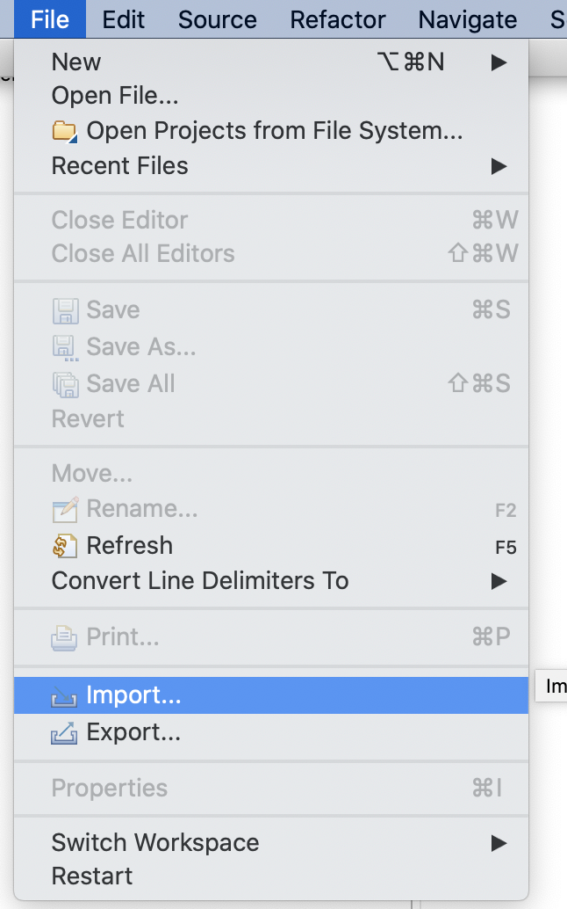
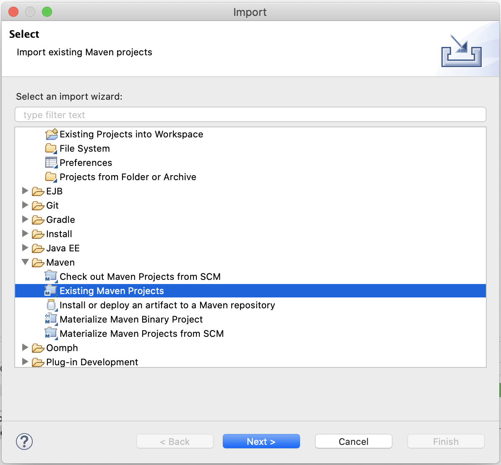
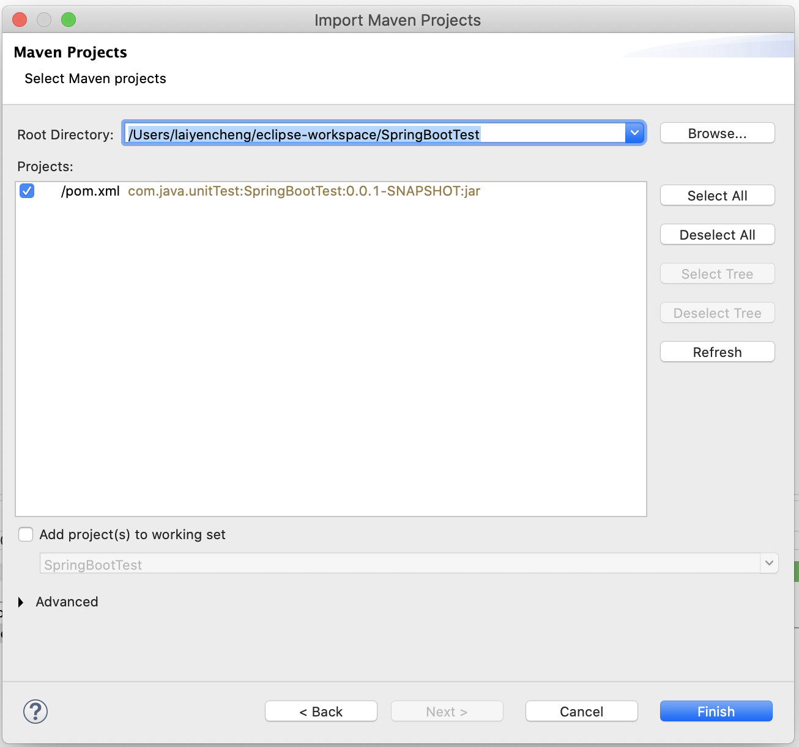
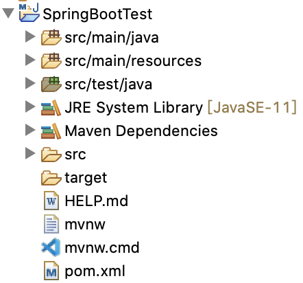

# Spring Boot 測試

## 簡介

### 什麼是 Spring Boot

Spring Boot 是現在 Java 語言最流行的 Spring framework 的進階精簡版，也是目前 Java 後端開發的主流選擇，多數開發者都會用其開發 RESTful API，本篇我們不會著墨在 Spring Boot 的知識以及撰寫，僅會針對測試相關的部分進行描述。

## 環境設定

### 建立一個 Spring Boot 專案

要從零開始建立一個 Spring Boot 專案其實非常簡單，Spring 框架至今已發展近 20 年，也有完善的生態系以及資源供我們使用。我們先前往以下網站，就可以建立一個簡單的 Spring Boot 專案：[https://start.spring.io/](https://start.spring.io/) 



進入網站後我們一樣選擇 Maven Project，按照之前建立 Maven Project 的方式，撰寫 GroupId 和 ArtifactId，Spring Initializr 會幫我們按照上面的配置建立 Maven 專案。因為我們要做的是一個 RESTful API 的 Spring Boot 專案，所以在 Add Dependencies 上記得要加上 Spring Web。

### 專案載入 eclipse

配置完成後，點擊 Generate 把專案下載下來並放到指定的路徑底下，再透過以下順序 import 進 eclipse：

File -&gt; Import



Maven -&gt; Existing Maven Projects



選擇我們剛剛建立的專案存放的位子



至此，專案便完成匯入。



打開專案可以看到由 Spring Initialzr 幫我們自動生成的 pom.xml：

```markup
<?xml version="1.0" encoding="UTF-8"?>
<project xmlns="http://maven.apache.org/POM/4.0.0" xmlns:xsi="http://www.w3.org/2001/XMLSchema-instance"
	xsi:schemaLocation="http://maven.apache.org/POM/4.0.0 https://maven.apache.org/xsd/maven-4.0.0.xsd">
	<modelVersion>4.0.0</modelVersion>
	<parent>
		<groupId>org.springframework.boot</groupId>
		<artifactId>spring-boot-starter-parent</artifactId>
		<version>2.4.2</version>
		<relativePath/> <!-- lookup parent from repository -->
	</parent>
	<groupId>com.java.unitTest</groupId>
	<artifactId>SpringBootTest</artifactId>
	<version>0.0.1-SNAPSHOT</version>
	<name>SpringBootTest</name>
	<description>Demo project for Spring Boot Testing</description>
	<properties>
		<java.version>11</java.version>
	</properties>
	<dependencies>
		<dependency>
			<groupId>org.springframework.boot</groupId>
			<artifactId>spring-boot-starter-web</artifactId>
		</dependency>

		<dependency>
			<groupId>org.springframework.boot</groupId>
			<artifactId>spring-boot-starter-test</artifactId>
			<scope>test</scope>
		</dependency>
	</dependencies>

	<build>
		<plugins>
			<plugin>
				<groupId>org.springframework.boot</groupId>
				<artifactId>spring-boot-maven-plugin</artifactId>
			</plugin>
		</plugins>
	</build>

</project>
```

spring-boot-starter-web 這個 jar 檔就是我們在 Spring Initializr 中特別加入的 Spring Web 的 dependency，有了這個 jar 檔我們才可以用 Spring Boot 寫 RESTful 的 Web Service。

spring-boot-starter-test 則是 Spring Initializr 預設帶給我們的，仔細看他在 pom.xml 中的配置，scope 為 test 代表只有測試時會引入這些資源，在 IDE 中按住 Ctrl \(Mac OS 按 Command\)，點擊 spring-boot-starter-test 就能夠檢視這個 jar 裡面究竟有什麼其他的 jar 的資源，這邊列出比較重要的有：

* JUnit 5
* Spring Test 和 Spring Boot Test
* AssertJ
* Hamcrest
* Mockito
* JSONAssert
* JsonPath

這些套件是 Spring 官方認為一般在撰寫測試時比較需要用到的套件，所以在建立專案時就會幫我們預先引入了，其中包含我們前面幾篇介紹到比較基礎 JUnit，還有建立mock object 的 Mockito。

### 撰寫前準備

在撰寫 Spring Boot Testing 之前，我們一樣簡單的產幾隻程式，模擬 Spring Boot 建立 RESTful API 的程式架構：

```text
  |-- com.java.unitTest.springBootTest
      |-- SpringBootTestApplication.java
  |-- com.java.unitTest.springBootTest.controller
      |-- UserController.java
  |-- com.java.unitTest.springBootTest.dao
      |-- User.java
  |-- com.java.unitTest.springBootTest.service
      |-- UserService.java
  |-- com.java.unitTest.springBootTest.service.impl
      |-- UserServiceImpl.java
```

除了 SpringBootTestApplication.java 是系統自動生成的以外，其餘的程式碼為我們簡單模擬對持久層存取 User 物件的 RESTFul Web Service。

建立對外接口 UserController.java：

```java
package com.java.unitTest.springBootTest.controller;

import org.springframework.beans.factory.annotation.Autowired;
import org.springframework.web.bind.annotation.GetMapping;
import org.springframework.web.bind.annotation.RequestMapping;
import org.springframework.web.bind.annotation.RequestParam;
import org.springframework.web.bind.annotation.RestController;

import com.java.unitTest.springBootTest.dao.User;
import com.java.unitTest.springBootTest.service.impl.UserServiceImpl;

@RestController
@RequestMapping("/user")
public class UserController {

	@Autowired
	private UserServiceImpl userSvcImpl;

	@GetMapping("hello")
	public String hello(@RequestParam("name") String name) {
		return "Hello, " + name;
	}

	@GetMapping("save")
	public void saveUser(@RequestParam("name") String name, @RequestParam("age") int age) {
		userSvcImpl.addUser(new User(name, age));
	}

}
```

設定處理 User 的 DAO  User.java：

```java
package com.java.unitTest.springBootTest.dao;

public class User {

	public User(String name, int age) {
		this.name = name;
		this.age = age;
	}

	private String name;

	private int age;

	public String getName() {
		return name;
	}

	public void setName(String name) {
		this.name = name;
	}

	public int getAge() {
		return age;
	}

	public void setAge(int age) {
		this.age = age;
	}

	@Override
	public int hashCode() {
		final int prime = 31;
		int result = 1;
		result = prime * result + age;
		result = prime * result + ((name == null) ? 0 : name.hashCode());
		return result;
	}

	@Override
	public boolean equals(Object obj) {
		if (this == obj)
			return true;
		if (obj == null)
			return false;
		if (getClass() != obj.getClass())
			return false;
		User other = (User) obj;
		if (age != other.age)
			return false;
		if (name == null) {
			if (other.name != null)
				return false;
		} else if (!name.equals(other.name))
			return false;
		return true;
	}

}
```

定義邏輯的抽象介面 UserService.java，並在此定義新增 User 的 addUser 抽象方法：

```java
package com.java.unitTest.springBootTest.service;

import com.java.unitTest.springBootTest.dao.User;

public interface UserService {

	void addUser(User user);

}
```

實作抽象方法的 UserServiceImpl.java，此處用打印的方式取代實際存取資料庫：

```java
package com.java.unitTest.springBootTest.service.impl;

import org.springframework.stereotype.Service;

import com.java.unitTest.springBootTest.dao.User;
import com.java.unitTest.springBootTest.service.UserService;

@Service
public class UserServiceImpl implements UserService {

	@Override
	public void addUser(User user) {
		System.out.println("User: " + user.getName() + " " + user.getAge() + " is saved.");
	}

}
```


