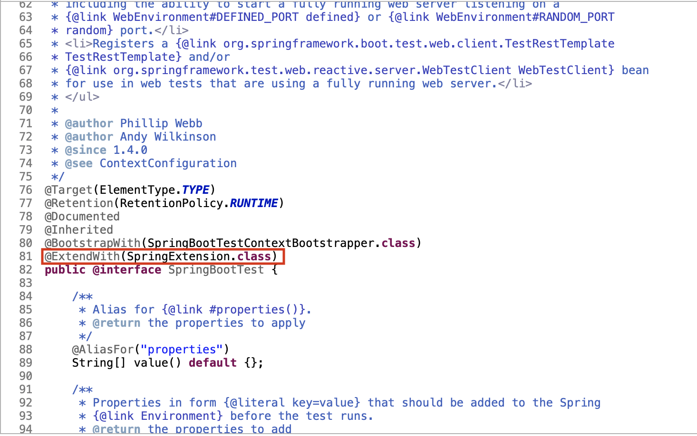

# Spring Boot 測試

## 簡介

### 什麼是 Spring Boot

Spring Boot 是現在 Java 語言最流行的 Spring framework 的進階精簡版，也是目前 Java 後端開發的主流選擇，多數開發者都會用其開發 RESTful API，本篇我們不會著墨在 Spring Boot 的知識以及撰寫，僅會針對測試相關的部分進行描述。

## 環境設定

### 建立一個 Spring Boot 專案

要從零開始建立一個 Spring Boot 專案其實非常簡單，Spring 框架至今已發展近 20 年，也有完善的生態系以及資源供我們使用。我們先前往以下網站，就可以建立一個簡單的 Spring Boot 專案：[https://start.spring.io/](https://start.spring.io/) 


進入網站後我們一樣選擇 Maven Project，按照之前建立 Maven Project 的方式，撰寫 GroupId 和 ArtifactId，Spring Initializr 會幫我們按照上面的配置建立 Maven 專案。因為我們要做的是一個 RESTful API 的 Spring Boot 專案，所以在 Add Dependencies 上記得要加上 Spring Web。

### 專案載入 eclipse

配置完成後，點擊 Generate 把專案下載下來並放到指定的路徑底下，再透過以下順序 import 進 eclipse：

File -&gt; Import


Maven -&gt; Existing Maven Projects


選擇我們剛剛建立的專案存放的位子


至此，專案便完成匯入。


打開專案可以看到由 Spring Initialzr 幫我們自動生成的 pom.xml：

```markup
<?xml version="1.0" encoding="UTF-8"?>
<project xmlns="http://maven.apache.org/POM/4.0.0" xmlns:xsi="http://www.w3.org/2001/XMLSchema-instance"
	xsi:schemaLocation="http://maven.apache.org/POM/4.0.0 https://maven.apache.org/xsd/maven-4.0.0.xsd">
	<modelVersion>4.0.0</modelVersion>
	<parent>
		<groupId>org.springframework.boot</groupId>
		<artifactId>spring-boot-starter-parent</artifactId>
		<version>2.4.2</version>
		<relativePath/> <!-- lookup parent from repository -->
	</parent>
	<groupId>com.java.unitTest</groupId>
	<artifactId>SpringBootTest</artifactId>
	<version>0.0.1-SNAPSHOT</version>
	<name>SpringBootTest</name>
	<description>Demo project for Spring Boot Testing</description>
	<properties>
		<java.version>11</java.version>
	</properties>
	<dependencies>
		<dependency>
			<groupId>org.springframework.boot</groupId>
			<artifactId>spring-boot-starter-web</artifactId>
		</dependency>

		<dependency>
			<groupId>org.springframework.boot</groupId>
			<artifactId>spring-boot-starter-test</artifactId>
			<scope>test</scope>
		</dependency>
	</dependencies>

	<build>
		<plugins>
			<plugin>
				<groupId>org.springframework.boot</groupId>
				<artifactId>spring-boot-maven-plugin</artifactId>
			</plugin>
		</plugins>
	</build>

</project>
```

spring-boot-starter-web 這個 jar 檔就是我們在 Spring Initializr 中特別加入的 Spring Web 的 dependency，有了這個 jar 檔我們才可以用 Spring Boot 寫 RESTful 的 Web Service。

spring-boot-starter-test 則是 Spring Initializr 預設帶給我們的，仔細看他在 pom.xml 中的配置，scope 為 test 代表只有測試時會引入這些資源，在 IDE 中按住 Ctrl \(Mac OS 按 Command\)，點擊 spring-boot-starter-test 就能夠檢視這個 jar 裡面究竟有什麼其他的 jar 的資源，這邊列出比較重要的有：

* JUnit 5
* Spring Test 和 Spring Boot Test
* AssertJ
* Hamcrest
* Mockito
* JSONAssert
* JsonPath

這些套件是 Spring 官方認為一般在撰寫測試時比較需要用到的套件，所以在建立專案時就會幫我們預先引入了，其中包含我們前面幾篇介紹到比較基礎 JUnit，還有建立mock object 的 Mockito。

### 撰寫前準備

在撰寫 Spring Boot Testing 之前，我們一樣簡單的產幾隻程式，模擬 Spring Boot 建立 RESTful API 的程式架構：

```text
  |-- com.java.unitTest.springBootTest
      |-- SpringBootTestApplication.java
  |-- com.java.unitTest.springBootTest.controller
      |-- UserController.java
  |-- com.java.unitTest.springBootTest.dao
      |-- User.java
  |-- com.java.unitTest.springBootTest.repository
      |-- UserRepository.java
  |-- com.java.unitTest.springBootTest.service
      |-- UserService.java
  |-- com.java.unitTest.springBootTest.service.impl
      |-- UserServiceImpl.java
```

除了 SpringBootTestApplication.java 是系統自動生成的以外，其餘的程式碼為我們簡單模擬對持久層存取 User 物件的 RESTFul Web Service。

建立對外接口 UserController.java：

```java
package com.java.unitTest.springBootTest.controller;

import java.util.List;

import org.springframework.beans.factory.annotation.Autowired;
import org.springframework.web.bind.annotation.GetMapping;
import org.springframework.web.bind.annotation.RequestMapping;
import org.springframework.web.bind.annotation.RequestParam;
import org.springframework.web.bind.annotation.RestController;

import com.java.unitTest.springBootTest.dao.User;
import com.java.unitTest.springBootTest.service.impl.UserServiceImpl;

@RestController
@RequestMapping("/user")
public class UserController {

	@Autowired
	private UserServiceImpl userSvcImpl;

	@GetMapping("hello")
	public String hello(@RequestParam("name") String name) {
		return "Hello, " + name;
	}

	@GetMapping("save")
	public void saveUser(@RequestParam("name") String name, @RequestParam("age") int age) {
		userSvcImpl.addUser(new User(name, age));
	}

	@GetMapping("getUsers")
	public List<User> getUser() {
		return userSvcImpl.getUsers();
	}

}
```

設定處理 User 的 DAO  User.java：

```java
package com.java.unitTest.springBootTest.dao;

public class User {

	public User(String name, int age) {
		this.name = name;
		this.age = age;
	}

	private String name;

	private int age;

	public String getName() {
		return name;
	}

	public void setName(String name) {
		this.name = name;
	}

	public int getAge() {
		return age;
	}

	public void setAge(int age) {
		this.age = age;
	}

	@Override
	public int hashCode() {
		final int prime = 31;
		int result = 1;
		result = prime * result + age;
		result = prime * result + ((name == null) ? 0 : name.hashCode());
		return result;
	}

	@Override
	public boolean equals(Object obj) {
		if (this == obj)
			return true;
		if (obj == null)
			return false;
		if (getClass() != obj.getClass())
			return false;
		User other = (User) obj;
		if (age != other.age)
			return false;
		if (name == null) {
			if (other.name != null)
				return false;
		} else if (!name.equals(other.name))
			return false;
		return true;
	}

}
```

調用對持久層操作的 UserRepository.java：

\( 此處我們以靜態集合的方式取代實際對持久層操作，真實專案上應對資料庫或檔案做實際存取 \)

```java
package com.java.unitTest.springBootTest.repository;

import java.util.ArrayList;
import java.util.List;

import org.springframework.stereotype.Repository;

import com.java.unitTest.springBootTest.dao.User;

@Repository
public class UserRepository {

	private static List<User> users;

	public List<User> getUsers() {
		if (users == null)
			users = new ArrayList<>();
		return users;
	}

	public void saveUser(User user) {
		if (users == null) {
			users = new ArrayList<>();
		}
		users.add(user);
	}

}
```

定義邏輯的抽象介面 UserService.java，並在此定義新增 User 的 addUser 抽象方法：

```java
package com.java.unitTest.springBootTest.service;

import java.util.List;

import com.java.unitTest.springBootTest.dao.User;

public interface UserService {

	void addUser(User user);
	
	List<User> getUsers();

}
```

實作抽象方法的 UserServiceImpl.java：

```java
package com.java.unitTest.springBootTest.service.impl;

import java.util.List;

import org.springframework.beans.factory.annotation.Autowired;
import org.springframework.stereotype.Service;

import com.java.unitTest.springBootTest.dao.User;
import com.java.unitTest.springBootTest.repository.UserRepository;
import com.java.unitTest.springBootTest.service.UserService;

@Service
public class UserServiceImpl implements UserService {

	@Autowired
	private UserRepository userRepo;

	@Override
	public void addUser(User user) {
		userRepo.saveUser(user);
	}

	@Override
	public List<User> getUsers() {
		return userRepo.getUsers();
	}

}
```

我們接著啟動專案後來驗證 Controller 的幾個入口是否有效：

#### 測試 hello 入口：

在 url 中輸入： [http://localhost:8080/user/hello?name=Frank](http://localhost:8080/user/hello?name=Frank)，則應該會看到 Hello, Frank：


#### 測試 save 入口：

在 url 中輸入：[http://localhost:8080/user/save?name=Frank&age=28](http://localhost:8080/user/save?name=Frank&age=28)，就會把 User 的資料存在我們寫的靜態集合中


#### 測試 getUsers 入口：

剛剛執行完 save 的請求後，我們可以接著透過 getUsers 入口取得目前所有的 User，在 url 中輸入：[http://localhost:8080/user/getUsers](http://localhost:8080/user/getUsers)，就可以在結果中看到剛剛新增的 User


至此，基本設定完成。

## 撰寫測試

### 基本介紹

在專案建立完成後，可以看到系統預設提供的 src/test/java 底下的有 Spring Initializr 幫我們建立好的測試類別，該類別的名稱會依照我們在建立專案時輸入的內容而定，此處的命名為 `SpringBootTestApplicationTests.java`，以下是他預設的樣貌：

```java
package com.java.unitTest.springBootTest;

import org.junit.jupiter.api.Test;
import org.springframework.boot.test.context.SpringBootTest;

@SpringBootTest
class SpringBootTestApplicationTests {

	@Test
	void contextLoads() {
	}

}
```

在這裡我們看到兩個 annotation，分別是 @SpringBootTest 和 @Test：

* @Test：如同我們在前篇章節中所介紹的內容，執行測試時會啟動該方法
* @SpringBootTest：
  * 宣告當前類別為測試類別
  * 載入 Spring Boot 的啟動類別，於測試時啟動 Spring Boot 環境執行測試

### 版本差異說明

如果你有看過幾隻 Spring Boot 的單元測試，可能會看到這種寫法：

```java
@RunWith(SpringJUnit4ClassRunner.class)
@ContextConfiguration(locations = { "classpath:application.xml" })
class SpringBootTestApplicationTests {
```

或者是這種寫法：

```java
@ExtendWith(SpringExtension.class)
@SpringBootTest
class SpringBootTestApplicationTests {
```

事實上，並非這些寫法就不對，只是因為 JUnit 和 Spring 的版本的更改後，撰寫的方式上也差距不少，以下一一說明：

* @RunWith 和 @ContextConfiguration 寫法 \( JUnit 4 寫法 \)
  * @RunWith
    * 用意是指定以哪個 class 去運行這個 JUnit 測試，沒有指定的話，JUnit 4 預設會使用 JUnit 的預設運行程式 `BlockJUnit4ClassRunner`這個類別執行測試
    * 此處使用 SpringJUnit4ClassRunner.class 是為引用 Spring 的執行環境
  * @ContextConfiguratrion
    *  用意為整合 JUnit 和 Spring 的環境，會去讀指定路徑的配置檔進行整合
* @ExtendWith 和 @SpringBootTest 寫法 \( JUnit 5 寫法 \)
  * @ExtendWith
    * 和 JUnit 4 時的 @RunWith 寫法相同，目的是指定運行類別，不同的地方是內容參數要改為引用 SpringExtension.class
  * @SpringBootTest
    * 如同我們上面介紹，用意為宣告測試類別

由於我們這一系列一開始就已經提過，我們會以 JUnit 5 為主要的測試版本，所以 @RunWith 的寫法我們不會採用。此外，隨著版本的更替，其實 @SpringBootTest 就包含了 @ExtendWith 的宣告，所以我們才僅需要寫 @SpringBootTest 即可



此外，如果按照本篇的環境撰寫時，不難發現我們如果嘗試用 @RunWith 的寫法時，eclipse 會告訴我們找不到 jar，如下圖：


圖中能看到 eclipse 的建議解法是加載 JUnit 4 的函式庫，原因就是因為我們使用的版本為 JUnit 5 ，如果要使用 JUnit 4 的 @RunWith 寫法，建議不要按照 eclipse 的建議加載 JUnit 4，而是應該要使用我們在介紹 JUnit 5 時提過的 JUnit Vintage，它的用途正是兼容 JUnit 5 以下版本。所以我們會在 pom.xml 加上這段：

```markup
<dependency>
    <groupId>org.junit.vintage</groupId>
		<artifactId>junit-vintage-engine</artifactId>
		<scope>test</scope>
</dependency>
```

如此便能夠使用 JUnit 4 的 @RunWith 寫法。

### 撰寫測試方法

接下來我們一樣以`SpringBootTestApplicationTest.java` 做測試程式，實際從頭開始撰寫實際的 Spring Boot 測試案例：

```java
package com.java.unitTest.springBootTest;

import java.util.ArrayList;
import java.util.List;

import org.junit.jupiter.api.Assertions;
import org.junit.jupiter.api.Test;
import org.mockito.Mock;
import org.mockito.Mockito;
import org.springframework.boot.test.context.SpringBootTest;

import com.java.unitTest.springBootTest.dao.User;
import com.java.unitTest.springBootTest.service.impl.UserServiceImpl;

@SpringBootTest
class SpringBootTestApplicationTests {

	@Mock
	private UserServiceImpl userSvcImpl;

	@Test
	void testSaveUser() {

		List<User> mockUserList = new ArrayList<>();
		mockUserList.add(new User("Jack", 24));
		mockUserList.add(new User("Frank", 26));
		mockUserList.add(new User("Peter", 28));

		Mockito.when(userSvcImpl.getUsers()).thenReturn(mockUserList);

		Assertions.assertEquals(3, userSvcImpl.getUsers().size());
	}

}
```

這邊我們一樣是使用 Mockito 來模擬對於持久層物件的操作，畢竟對於 DB 的操作應該是單元測試的範疇之外。我們要著重管理與測試的部分，仍舊應是 Service 中關於邏輯的方法部分。

但如果我們只是針對 Service 使用 Mockito 進行管理，不難發現仍會調用到真實的 Repository 物件對資料庫進行存取，所以我們將剛才的測試方法進行修正：

```java
package com.java.unitTest.springBootTest;

import java.util.ArrayList;
import java.util.List;

import org.junit.jupiter.api.Assertions;
import org.junit.jupiter.api.Test;
import org.mockito.InjectMocks;
import org.mockito.Mock;
import org.mockito.Mockito;
import org.mockito.invocation.InvocationOnMock;
import org.mockito.stubbing.Answer;
import org.springframework.boot.test.context.SpringBootTest;

import com.java.unitTest.springBootTest.dao.User;
import com.java.unitTest.springBootTest.repository.UserRepository;
import com.java.unitTest.springBootTest.service.impl.UserServiceImpl;

@SpringBootTest
class SpringBootTestApplicationTests {

	@Mock
	private UserRepository userRepo;

	@InjectMocks
	private UserServiceImpl userSvcImpl;

	@Test
	void testSaveUser() {
		List<User> mockUsers = new ArrayList<>();

		Mockito.doAnswer(new Answer<Void>() {
			public Void answer(InvocationOnMock invocation) {
				User user = invocation.getArgument(0);
				mockUsers.add(user);
				return null;
			}
		}).when(userRepo).saveUser(Mockito.any(User.class));

		Mockito.when(userSvcImpl.getUsers()).thenReturn(mockUsers);

		userSvcImpl.addUser(new User("Jack", 24));
		userSvcImpl.addUser(new User("Frank", 26));
		userSvcImpl.addUser(new User("Peter", 28));

		Assertions.assertEquals(3, userSvcImpl.getUsers().size());
		Assertions.assertEquals("Jack", userSvcImpl.getUsers().get(0).getName());
		Assertions.assertEquals("Frank", userSvcImpl.getUsers().get(1).getName());
		Assertions.assertEquals("Peter", userSvcImpl.getUsers().get(2).getName());
		Assertions.assertEquals(24, userSvcImpl.getUsers().get(0).getAge());
		Assertions.assertEquals(26, userSvcImpl.getUsers().get(1).getAge());
		Assertions.assertEquals(28, userSvcImpl.getUsers().get(2).getAge());
	}

}
```


